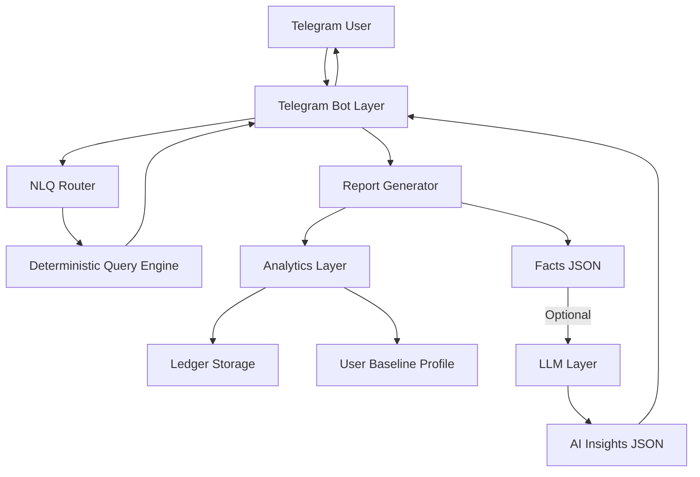
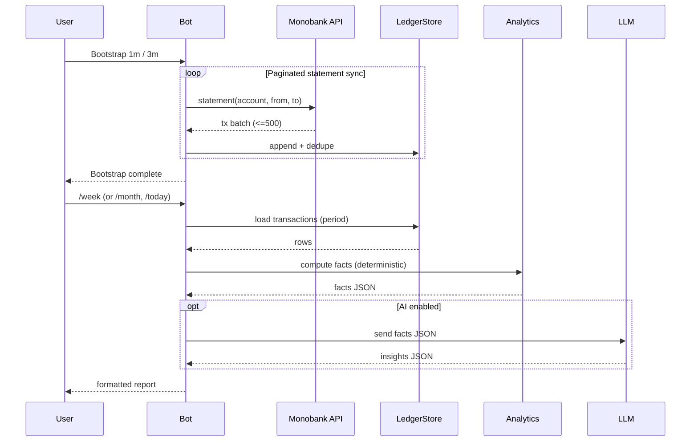
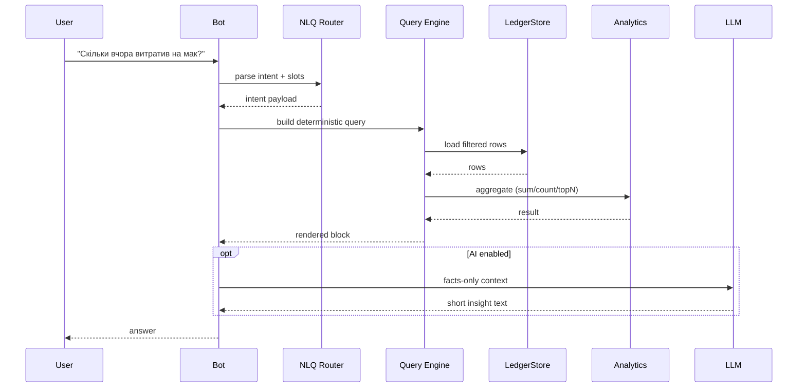

# Mono AI Budget Bot

Telegram-бот для аналітики витрат Monobank з контрольованою AI-надбудовою.

Ідея: бот підключається до Monobank Personal API (per-user token), синхронізує транзакції по обраним рахункам/карткам, рахує метрики за період (детерміновано кодом) і формує структурований звіт.  

AI (LLM) отримує лише агреговані facts (JSON) і генерує текстові інсайти, не маючи доступу до сирих транзакцій.

Проєкт створено як тестове завдання на AI-інтернатуру з акцентом на:
- архітектуру
- стабільність
- контроль над AI
- безпеку даних
- UX
- роботу з обмеженнями Monobank API

AI застосовувався не лише для генерації тексту, а як інженерний інструмент:  
проєктування архітектури, формування LLM-структур, guardrails, NLQ-обробка, рефакторинг, оптимізація API-взаємодії.

Мета — продемонструвати системну, безпечну та контрольовану інтеграцію AI в реальний продукт.

## What it does (MVP)

### 1️⃣ Connect
- `/connect <token>` — підключення Monobank (read-only)
- `/status` — стан підключення + кеш звітів

### 2️⃣ Accounts selection
- `/accounts` — вибір рахунків/карток
- після `Done` → bootstrap 1 або 3 місяці
- далі інкрементальний sync

### 3️⃣ Reports
- `/today`
- `/week`
- `/month`
- порівняння з попереднім періодом
- breakdown по картках
- top categories / merchants
- anomalies / spikes
- AI insights (optional)

### 4️⃣ NLQ (Natural Language Queries)
Можна просто написати:
- "Скільки я вчора витратив на мак?"
- "Скільки за січень було поповнень?"
- "На скільки більше вчора витратив на бари ніж зазвичай?"

Router → deterministic engine → (optional) AI summary.

### 5️⃣ Scheduler (optional)
- weekly / monthly авто-звіти
- фонова синхронізація
- per-user locks

## Architecture Overview

Принцип: **"Code computes facts — LLM writes text."**

### 1️⃣ Analytics Layer (deterministic)
- ledger (транзакції)
- категоризація
- обчислення totals / counts
- topN / breakdown
- compare periods
- baseline profile (median/avg)
- anomaly detection

Усі суми рахуються кодом.

### 2️⃣ AI Layer (controlled)
LLM отримує:
- facts JSON
- (optional) user_profile

LLM повертає:
- summary
- changes
- recommendations
- next_step

LLM не:
- рахує гроші
- не має доступу до сирих транзакцій
- не дає фінансових гарантій

### 3️⃣ Guardrails
- structured JSON schema
- strict validation
- graceful fallback
- no hallucinated numbers

## Architecture Diagram

## NLQ Engine

NLQ реалізований без LLM (regex-router + query engine).

Підтримує:
- spend_sum
- spend_count
- income_sum
- transfer_in_count
- compare_to_baseline
- періоди: yesterday, N days, week, month, month-name
- merchant filter
- category keywords
- alias memory

Flow:
User text → Intent parsing → Query JSON → Deterministic execution → Render → Optional AI summary

## Monobank API Constraints

### Rate limits
- 1 request / 60 sec per endpoint

### Statement range
- максимум 31 день + 1 година за один запит

### Solution
- локальний rate limiter
- retry/backoff на 429
- кешування
- pagination по 31d блоках
- інкрементальний sync
- overlap-window для уникнення втрат
- per-user locks

## Data Flow Model (MVP)

### Data sources
- **Monobank API**: client-info, statement
- **User input**: NLQ text, account selection, aliases

### Pipelines
#### 1) Ingestion (Monobank → Ledger)
1. Bot fetches `client-info` (accounts list)
2. Bot fetches `statement(account, from, to)` in paginated windows
3. Each transaction is normalized and stored in **ledger** (JSONL / cache)
4. Dedup is applied (by tx id + overlap window)

Output:
- `ledger_rows[]` — raw-ish transaction rows for deterministic analytics

#### 2) Deterministic Analytics (Ledger → Facts)
1. Ledger rows are filtered by:
   - date range (yesterday / last N days / month name)
   - kind (spend / income / transfers)
   - merchant filter (aliases + normalized contains)
   - category filter (keywords → MCC taxonomy)
2. Aggregations are computed:
   - sum / count
   - top merchants / categories
   - breakdown per day (optional)
3. Baseline profile is built (median/avg, weekday-aware) for “than usual” comparisons
4. Anomaly detection flags spikes by merchant/category

Output:
- `facts.json` — **strict structured facts** (numbers computed by code)

#### 3) AI Insight Layer (Facts → Text)
Input to LLM:
- `facts.json` only (aggregated, no raw transactions)
- optional `profile.json` (baseline summaries)

LLM returns:
- short textual insights
- anomalies explanation
- suggested next steps inside the bot (non-financial advice)

Hard constraints:
- LLM does **not** compute totals
- LLM output is validated (schema / required fields)
- if LLM fails → facts-only report

#### 4) Rendering (Facts + Optional AI → Telegram)
- Report templates render:
  - Facts
  - Trends
  - Anomalies
  - AI insights (optional)
- Cached reports are stored for `/today|week|month`

### Data minimization
- Raw transaction rows stay local in ledger/cache
- LLM sees only aggregated facts

## Data Storage (Local Mode)

До хостингу дані зберігаються локально:

.cache/
- users (config + encrypted token)
- ledger (JSONL)
- reports (cached)
- profiles (baseline)
- meta (last_sync)

Очистити для чистого тесту:
- видалити директорію .cache

## Security Model

### Token Security
- Monobank token — read-only
- Зберігається зашифрованим (Fernet + MASTER_KEY)
- Ніколи не логуються

### Data Minimization
- LLM не отримує сирі транзакції
- Передаються лише агреговані facts JSON

### AI Guardrails
- Structured output schema
- Strict validation
- No financial guarantees
- No hallucinated numbers
- Graceful fallback при помилці AI

### Failure Safety
- Якщо LLM недоступний → бот працює у facts-only режимі
- Якщо Monobank 429 → retry/backoff
- Якщо кеш відсутній → дружні підказки користувачу

## User Flow (Quickstart)

1️⃣ `/connect <token>`  
2️⃣ `/accounts` → обрати картки → Done  
3️⃣ Bootstrap 1м або 3м  
4️⃣ `/week` або `/month`  
5️⃣ Писати NLQ запити текстом  

Бот завжди підказує наступний крок.

## Testing Strategy

### Unit Tests
- NLQ parsing
- Period derivation
- Intent routing
- Merchant extraction
- Category mapping
- Analytics math
- Report rendering

### Integration Tests
- Pagination logic
- Rate limit handling
- Retry/backoff
- Memory store

### Snapshot Tests
- Report layout stability
- Text block consistency

### Failure Mode Tests
- LLM timeout
- Invalid AI schema
- Missing cache
- No accounts selected

Мета: бот не падає у жодному сценарії.

## Sequence Flow (MVP)

### Bootstrap & Reports

### NLQ (Natural Language Query)

Core:
- /start
- /connect
- /status
- /accounts
- /bootstrap
- /refresh today|week|month
- /today
- /week
- /month

NLQ:
- будь-яке текстове питання

Memory:
- /aliases (якщо увімкнено)

## Environment Variables

Required:
- TELEGRAM_BOT_TOKEN
- MASTER_KEY

Optional:
- OPENAI_API_KEY
- OPENAI_MODEL
- CACHE_DIR
- LOG_LEVEL

Scheduler:
- SCHED_TZ
- SCHED_REFRESH_MINUTES
- SCHED_WEEKLY_CRON
- SCHED_MONTHLY_CRON

## Local Setup (Poetry)

poetry install  
cp .env.example .env  
(згенерувати MASTER_KEY)  

Запуск:
poetry run monobot bot  

Тести:
poetry run pytest  

Якщо OPENAI_API_KEY не задано → facts-only mode.

## Demo Screenshots

Connect flow  
docs/demo/connect.png  

Accounts picker  
docs/demo/accounts.png  

Weekly report  
docs/demo/week.png  

NLQ example  
docs/demo/nlq.png  

## Roadmap

### Stretch (AI)
- Smart tagging via LLM
- Planner-based NLQ
- Query Engine v3
- Conversational tool mode

### Product
- Custom categories
- User rules engine
- Gamification
- Achievements
- Streaks

### Hosting
- Cloudflare Workers
- Persistent storage (D1 / KV)
- Async HTTP client
- Global refresh with jitter

## Deployment Model

### Local Mode (MVP)
- JSON storage
- File-based rate limiting
- Per-user locks

### Cloudflare (Planned)
- Worker runtime
- Persistent KV/D1 storage
- Async HTTP client
- Global refresh scheduler (jittered)
- Centralized rate limit control

### Scaling Strategy
- User-isolated data
- Stateless bot layer
- Storage abstraction (local vs cloud)

## Why this project

Це демонстрація:

- архітектурного мислення
- роботи з AI як системним інструментом
- контрольованої інтеграції LLM
- production-підходу до API-обмежень
- безпеки
- UX-дизайну
- чистої структури комітів

AI тут — не “магiя”, а керований компонент в інженерній системі.